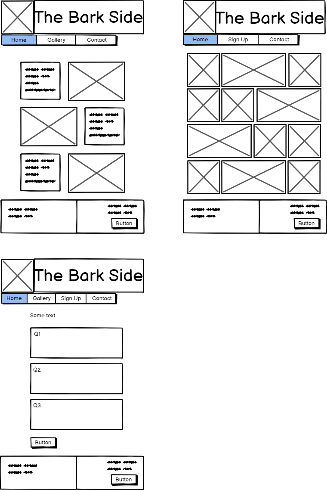

# PAGE NAME:  
THE BARK SIDE

# PURPOSE & OBJECTIVE:  
To:  
* Share information on common pets  
* Host a signup form for visitors to receive monthly newsletter with personalised pet updates  
* Share images of animals and create a positive happy feeling about the site  
* Assist in the decision making process regarding which pet is most suitable

# META DESCRIPTION:  
The Bark Side is all about pets. Discover what they eat, how they play, how to care for your pet with links to:  
* Informational and wellness partners  
* Vets, homes and shelters
* Food stockists

# KEYWORDS:  
pet, animal, dog, cat, exercise, food, habits, wellness, insurance

# TARGET AUDIENCE:  
- Pet owners
- Prospective pet owners
- Pet enthusiasts

# USER OBJECTIVES:  
Appealing images of pets at their best  
Relevant information on pet ownership, grouped by animal type (to be improved in future editions)  
Simple navigation by characteristic of choice (to be improved in future editions using JavaScript)  
Form allowing users to join the mailing list, ask a question, or upload an image of their pet to the gallery page
FAQ section for quick reference  

# UX DESIGN:  
A mobile-first approach was taken:  
* Title Logo and Navbar (same across all pages) occupies full screen width
* Nav Bar sits alongside logo and collapses using Bootstrap hamburger menu on smaller screens
* Site expands to larger views easily

# PAGE CONTENT:  

All pages:
* Navbar:
  	Logo and links to:
  		About Us
  		Pets
  		Gallery
  		Sign Up
  		Help section:
  			Contact
  			Submit question or suggestion
  			FAQ
* Footer with links to social platforms and link to form  for questions / suggestions
	Social media links
	Cruft link
	RSPCA link (released in future editions
	Battersea Dogs & Cats Home link (released in future editions

Home page:
* Content blocks which visually link to relevant pages

About Us page:
* Brief introduction

Pets page:

Gallery page:
* Display image submittted by file upload from users
* 
Form page:
* Form capturing opt in to newsletter, details of pet ownership among users of the site, and free text field for messages & comments

FAQ page:
* Bootstrap accordion with FAQ (to be updated based on user guidance)
  

* Section about each pet:
Dogs
Cats
Furballs: Rabbits, Guinea pigs, Hamsters	-->	future editions
Fish & birds					-->	future editions
Creepy Crawlies: Lizards, Spiders, Snakes	--> 	future editions
			

# IMAGERY:
* Home page:  
	Hero image of happy pets

* Pets page:
  	Accordion of each size of pet

# AUDIO:
* Pets page:
  	Sound clips of different animals making different amounts of noise

# ACCESSIBILITY:  
All external links open in a separate tab when clicked
Alt fields on all images if not displayed
Screen Reader fields on Bootstrap carousel controls

# RESOURCES
Site name & brand: [lifelearn.com](https://www.lifelearn.com/2016/02/24/the-jumbo-reference-list-of-pet-puns/)  
The name for the site "The Bark Side" was selected, with "Pawsome" and "Pet-tential" close contenders

Logo design: [Looka Logos](https://looka.com/editor/144159302)  
Logo design and creative ideas; though none selected, the idea for a paw icon was decided

Gallery page: [Code Institute - Love Running project](https://learn.codeinstitute.net/dashboard)  
After completing this project, the idea of a gallery page was decided and many variations tried
   	
CSS grid: [Scrimba](https://scrimba.com/learn/cssgrid)  
Considering Bootstrap options, and after watching the "Learn CSS Grid" tutorial, the responsive flex image grid was implemented for the gallery, breaking with the Bootstrap 12-column format of the rest of the site

R. Mclelland: Code Institute mentor
With major support, advice and suggestions from Ronan, I was able to take huge steps forward in productivity and ways of working. Many resources were discussed, including images, colour, design and IDE's.

# TESTING:  
[W3 HTML Validator](https://validator.w3.org/#validate_by_input)  
Regular validation of HTML
  
[W3 CSS Validator](https://jigsaw.w3.org/css-validator/)  
Regular validation of CSS

# DEPLOYMENT PROCEDURE
This project was deployed using GitHub pages. The steps followed were:

<ol>
<li>From within GitHub, and the repository for this project, select settings</li>
<li>Under 'Code & Automation' on the left-hand menu, select 'Pages'</li>
<li>Under 'Build & Deployment' select 'Deploy from branch'</li>
<li>Under 'Branch' select 'Main' as the source, and 'folder' as '/(root)' (default value)</li>
<li>Press Save</li>
<li>A box at the top of the 'Pages' page shows the site is live with the related URL.</li>
</ol>

[Link to The Bark Side](https://jlnmrchnd.github.io/milestone1/)
